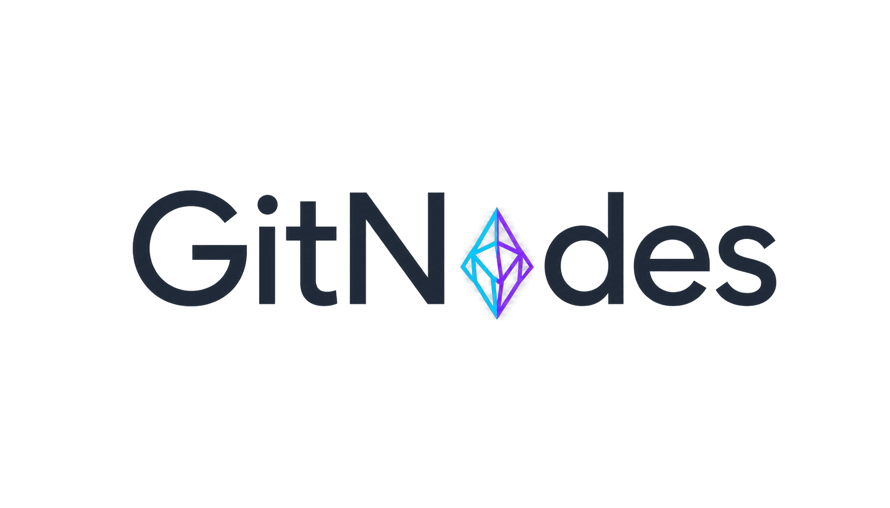
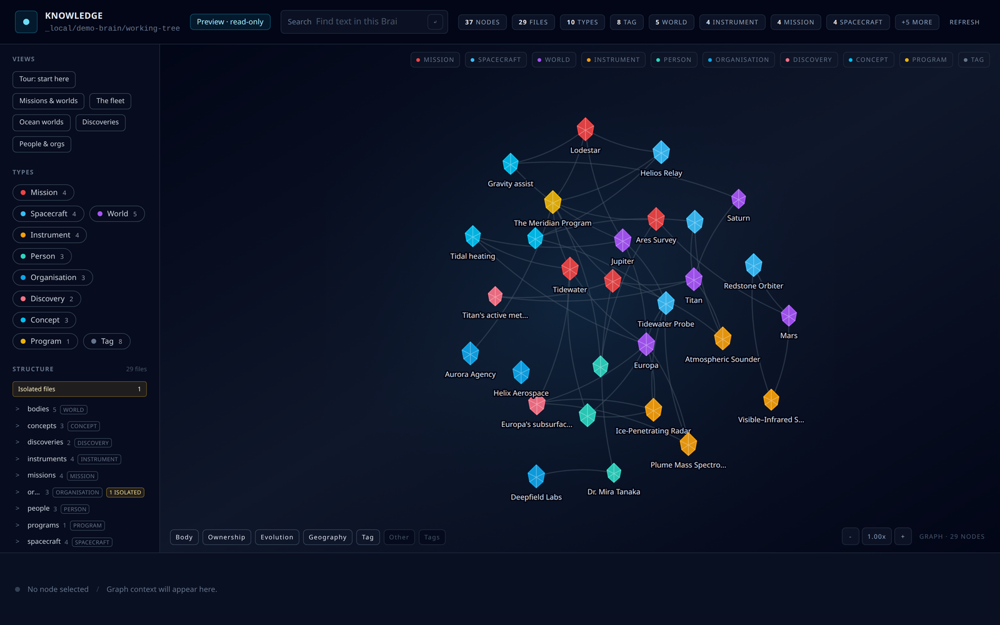

<p align="center">
  <picture>
    <source media="(prefers-color-scheme: dark)" srcset="public/brand/gitnodes-wordmark-dark.png">
    
  </picture>
</p>

<p align="center">
  <strong>Turn a GitHub repo of markdown notes into a knowledge graph you — and your AI agents — can explore, search, and edit.</strong>
</p>

<p align="center">
  <a href="https://github.com/AndreaBozzo/gitnodes/actions/workflows/ci.yml"></a>
  <a href="https://github.com/AndreaBozzo/gitnodes/releases/latest"></a>
  <a href="LICENSE"></a>
  
  
</p>

GitNodes points at a GitHub repository of markdown files and makes it navigable: a
force-directed graph of how your notes link together, a wiki-style reader, and an
in-app editor that commits changes straight back to GitHub. Declare your own note
types and relationships in a single `.gitnodes.yml` file and GitNodes builds the
graph, the typed links, and a full-text search index for you.

Your notes stay in Git — there is no separate database to migrate into and nothing
to lock you in. Point a coding agent (Claude Code, Cursor, Codex, …) at the same
repository over MCP and it can search and walk the graph instead of grepping blind,
then write changes back as ordinary, reviewable commits.

- **Browse** — explore the graph of your notes and their links, with ranked full-text search.
- **Edit** — create, link, and rename notes in-app; each change lands as a direct commit or a pull request, following your GitHub permissions.
- **Agent-native** — a read-only MCP server lets agents traverse your knowledge graph; they author back through Git, never behind your back.
- **Git-native** — Git is the single source of truth. The local index is just a rebuildable projection: delete it and it rebuilds from `git clone` alone.

<p align="center">
  
</p>
<p align="center">
  <a href="https://gitnodes-demo-production.up.railway.app" rel="external">▶ Try the live demo</a>
</p>
<p align="center">
  <em>The brain above ships in <a href="examples/demo-brain"><code>examples/demo-brain</code></a> — run <code>gitnodes preview examples/demo-brain</code> to explore it yourself.</em>
</p>

## Early presentation

GitNodes was presented publicly under its former working name, **Brain UI**, at
Talent Garden Cosenza on 3 June 2026. The event recording is available on
[LinkedIn](https://www.linkedin.com/events/7467916975424606209/).

## Quickstart

### Install

**Homebrew (macOS / Linux):**

```bash
brew install andreabozzo/tap/gitnodes
```

**macOS / Linux** — or download, review, run:

```bash
curl -fSLo install-gitnodes.sh https://raw.githubusercontent.com/AndreaBozzo/gitnodes/main/scripts/install.sh
less install-gitnodes.sh        # review before running
sh install-gitnodes.sh
```

**Windows (PowerShell)** — download, review, run:

```powershell
Invoke-WebRequest https://raw.githubusercontent.com/AndreaBozzo/gitnodes/main/scripts/install.ps1 -OutFile install-gitnodes.ps1
Get-Content .\install-gitnodes.ps1   # review before running
& .\install-gitnodes.ps1
```

Both drop a single `gitnodes` binary on your `PATH` — no Rust toolchain, no
compiling. Prefer to fetch it yourself? Grab an archive from
[Releases](https://github.com/AndreaBozzo/gitnodes/releases/latest) and put
`gitnodes` (or `gitnodes.exe`) on `PATH`.

> A WinGet package (`winget install AndreaBozzo.GitNodes`) is pending review in
> [microsoft/winget-pkgs](https://github.com/microsoft/winget-pkgs) and will work
> once merged.

### First run

```bash
gitnodes init my-brain      # starter notes + .gitnodes.yml + AGENTS.md
cd my-brain
gitnodes preview            # opens the read-only graph; no GitHub or login
```

The same working tree is immediately available to coding agents. Configure the
agent to launch this stdio command rather than running it manually:

```bash
gitnodes mcp .              # read-only stdio MCP server
```

When you want collaborative editing and pull-request workflows, publish it:

```bash
git add . && git commit -m "Initialize GitNodes knowledge base"
gh repo create my-brain --private --source=. --remote=origin --push
gitnodes doctor             # validates notes, Git state, remote, and gh auth
gitnodes serve              # discovers the repo, reuses `gh auth`
```

If needed, run `gh auth login` once before the commands above. GitNodes reads the
repository and branch from the local Git checkout and uses the credential already
stored by GitHub CLI; it does not copy that token into `.env` or another file.
`GITHUB_PAT` remains available as an explicit single-user fallback.
`gitnodes preview` keeps its SQLite projection and sessions in memory and never
writes runtime state into the knowledge directory. The scaffolded `AGENTS.md`
teaches coding agents (Claude Code, Codex, Cursor, …)
the conventions of your brain so they can add and link notes correctly. GitNodes
is built for humans and agents alike.

> This per-brain `AGENTS.md` is generated from your brain's `.gitnodes.yml` and
> describes *that knowledge base's* taxonomy. It is distinct from the `AGENTS.md`
> at the root of this repository, which guides contributors working on GitNodes
> itself.

The source boundary matters: `preview` and MCP read the local working tree,
including uncommitted files; `serve` and deployments read the pushed GitHub
branch. See the [end-to-end getting-started
guide](docs/guides/GETTING_STARTED.md) before switching modes.

## Build from source

Prefer to compile it yourself, or on a platform without a prebuilt binary?

```bash
rustup target add wasm32-unknown-unknown
cargo install cargo-leptos --locked --version 0.3.6
npm ci
npm run build:css
cargo leptos build --release
cargo build --release -p gitnodes-app --bin gitnodes-app \
  --no-default-features --features embed-assets
```

Put `target/release/gitnodes-app` (or `.exe`) on `PATH` as `gitnodes`.

## Documentation

- [Getting started: local preview to GitHub-backed use](docs/guides/GETTING_STARTED.md)
- [Configuration reference](docs/guides/CONFIGURATION.md)
- [Deployment guide](docs/guides/DEPLOYMENT.md)
- [Complete feature inventory and limitations](docs/FEATURES.md)
- [Operator notes and recovery](docs/OPERATOR_NOTES.md)
- [Roadmap](docs/ROADMAP.md)

## AI agent access

GitNodes includes a read-only local MCP server (`gitnodes mcp [dir]`, stdio).
It re-indexes the working tree before each request through the same SQLite
projection and FTS5 search path as the web UI, so uncommitted notes are visible
immediately. No PAT, GitHub login, push, or running web server is required.

It exposes five tools:

- **`search_brain`** — full-text search, ranked like the UI (type/tag/path filters).
- **`list_nodes`** — enumerate notes, filtered by type, tag, or directory.
- **`read_node`** — one note's projected metadata plus its markdown body.
- **`node_links`** — walk a note's incoming and outgoing graph edges (body links,
  frontmatter links, shared tags) so the agent traverses the graph instead of grepping.
- **`validate_brain`** — report malformed frontmatter, taxonomy mismatches,
  invalid tags, and unresolved links without changing the working tree.

### Wiring it into your agent

The launch command is identical for every client — `gitnodes mcp <path-to-your-brain>`.
Only *where* the config lives differs, and that drifts between releases, so use the
one-line CLI commands where they exist and otherwise drop in the standard JSON. Use the
absolute path to your brain checkout in every example below.

**CLI agents** — one command each:

```bash
# Claude Code (add --scope project to write a committable .mcp.json in the repo)
claude mcp add gitnodes -- gitnodes mcp /absolute/path/to/my-brain

# Codex CLI (or hand-edit ~/.codex/config.toml under [mcp_servers.gitnodes])
codex mcp add gitnodes -- gitnodes mcp /absolute/path/to/my-brain
```

**JSON-config editors** — Cursor (`.cursor/mcp.json`), Antigravity
(`~/.gemini/config/mcp_config.json`, or the IDE's *Manage MCP Servers → View raw config*),
Cline, Windsurf, Claude Desktop, Continue. Add the standard `mcpServers` entry; see each
client's MCP docs for the exact file:

```json
{
  "mcpServers": {
    "gitnodes": {
      "command": "gitnodes",
      "args": ["mcp", "/absolute/path/to/my-brain"]
    }
  }
}
```

### 60-second test

Once the server is configured, ask your agent something that forces a graph hop,
for example:

> Use the gitnodes tools to find notes about *knowledge graphs*, then show me
> what the top result links to and summarise it.

A working setup will call `search_brain`, then `node_links` on the top hit's
path, then `read_node` to pull the full note — discovering structure you never
had to describe.

### Letting an agent maintain the brain

The MCP server is read-only **by design**: agents discover through it, but they
write through Git, which stays the single source of truth. The authoring loop:

1. The agent edits markdown files directly in the checkout. The scaffolded
   `AGENTS.md` (generated from `.gitnodes.yml`) teaches it the node types,
   frontmatter rules, and link conventions, so its edits land on-taxonomy.
2. Commit and push, or open a pull request — every change is an ordinary,
   reviewable commit.
3. `gitnodes serve` (or the deployed app) rebuilds the projection from Git on the
   next sync; the new notes appear in the graph and in the agent's tools.

Because Git is the interface, no special write API is needed and nothing edits
your knowledge base behind your back.

## Stack

- **Rust / Leptos 0.8** — SSR + WASM hydration (`cargo leptos`)
- **Axum 0.8** — HTTP server, session middleware, auth routes
- **tower-sessions 0.14** + `tower-sessions-sqlx-store 0.15` — persistent sessions on SQLite
- **reqwest 0.12** — GitHub REST API client (no octocrab)
- **pulldown-cmark** — markdown → HTML, shared between SSR and client (live editor preview)
- **Tailwind CSS 3 + `@tailwindcss/typography`** — styling, built via Node toolchain
- **SQLite** — sessions, audit log, and target-scoped projection (`nodes`, `edges`, `files`, `backlinks`, `work_items`, `work_item_bindings`); content source of truth still lives in GitHub

## Workspace layout

```
crates/
  gitnodes-domain/    # Pure domain types: BrainConfig, NodeTypeSpec, WorkItem, GithubClient
  gitnodes-graph/     # Graph building + force-directed layout (no I/O)
  gitnodes-storage/   # GitHub API calls: tree walk, file CRUD, asset upload, atomic Git Data commits
  gitnodes-auth/      # GitHub OAuth token exchange + optional org membership check
  gitnodes-app/       # Leptos app + Axum entrypoint (SSR binary + WASM bundle)
    src/
      main.rs                   # Axum entrypoint, session store, auth routes
      api.rs                    # Server functions: graph/file/work-item reads, writes, rebuilds
      mcp.rs                    # Read-only local agent tools over stdio MCP
      markdown.rs               # pulldown-cmark wrapper + frontmatter splitter
      server/assets.rs          # Authenticated proxy for private-repo images
      server/projection/        # SQLite projection materialization + read model
      server/health.rs          # /healthz and /readyz operational probes
      server/pending_sync_job.rs # Background retry loop for provider sync outbox
      server/webhook.rs         # GitHub webhook entrypoint (push + item sync)
      server/sse.rs             # Per-target typed SSE event bus + stream endpoint
      server/installation_token.rs # GitHub App JWT → installation token, cached + refreshed
      knowledge/
        page.rs                 # /knowledge route composition
        graph_canvas.rs         # SVG graph view
        filter_panel.rs         # Tag + type filters (dynamic from config)
        editor/                 # Create/update form split into focused submodules
        detail_bar.rs           # Bottom strip: hover/selection summary
        detail_panel.rs         # Right-hand slide-out: rendered markdown + work-item card
        orphan_banner.rs        # Amber advisory for unknown node types
        config_loader.rs        # 30s TTL cache for .gitnodes.yml
        draft.rs                # localStorage autosave (schema v2)
docs/
  README.md
  FEATURES.md
  guides/
    GETTING_STARTED.md
    CONFIGURATION.md
    DEPLOYMENT.md
  OPERATOR_NOTES.md
  ROADMAP.md
```

## Configuration

Node types are declared in `.gitnodes.yml` at the root of the target repo.
The binary ships a built-in default equivalent to seven starter types
(concept, adr, meeting, post-mortem, project, runbook, tag), so repos without
the file keep working unchanged. Repos created before the rename are still read
from a legacy `.brain-config.yml` if `.gitnodes.yml` is absent.

The built-in default doubles as a worked example: any repo of markdown files
with YAML frontmatter works as a target, with or without a config file.

Work items are configured the same way: node types can declare `work_item_kind`, and
the label taxonomy in `.gitnodes.yml` drives provider-facing labels without hardcoding
GitHub-specific names in the app.

Saved views accept an optional `weight:` (integer; lower = earlier, default 0) so a
single pinned view can float to the top without re-ordering every entry. Individual
notes can declare an optional `cover:` in their frontmatter — a repo-relative image
path or an absolute `https://` URL — to render a hero image at the top of the detail
panel. Backlinks in the detail panel are grouped by node type, in the same order as
`node_types[]`.

### Typed graph edges (`link_fields`)

Node types can opt into **typed edges** by declaring `link_fields:` — a map from a
frontmatter field name to the target node type. The graph builder resolves slug
values in those fields against existing files and materializes edges tagged with
the source field name, alongside the body-link edges that already exist.

```yaml
- name: pokemon
  directory: pokemon
  link_fields:
    trainer: trainer          # pokemon.trainer  → ownership
    locations: route          # pokemon.locations → encounter geography
    evolves_to: pokemon       # pokemon.evolves_to → evolution chain
```

The canvas styles edges by their kind (`Body`, `Frontmatter(field)`, `Tag`) and
exposes a toggle legend in the bottom-left so users can isolate ownership,
geography, evolution, or tag relations from narrative body citations. Slugs that
don't resolve to an existing file are silently ignored — useful for documenting
future entities without breaking the graph. The field is optional and
backward-compatible (empty = no typed edges).

## Environment variables

For local `gitnodes serve [dir]`, the target repository, branch, and credential
are discovered from the Git checkout and GitHub CLI login. Explicit environment
configuration always takes precedence.

Required for deployments or checkouts without an `origin` remote:

| Var                        | Purpose                                   |
| -------------------------- | ----------------------------------------- |
| `TARGET_GITHUB_REPOSITORY` | Default repository in `owner/repo` format |

Choose one authentication mode:

| Var                    | Purpose |
| ---------------------- | ------- |
| `GITHUB_PAT`           | Single-user mode: use this PAT for every GitHub request; no OAuth App required. |
| `GITHUB_CLIENT_ID` + `GITHUB_CLIENT_SECRET` | Multi-user mode: GitHub OAuth App credentials. |

> **OAuth scope note.** In multi-user OAuth mode, login requests GitHub's `repo`
> scope — an OAuth App cannot be restricted to a single repository, so the issued
> token can read and write *all* of the user's repositories. GitNodes stores it
> encrypted at rest, uses it server-side only, and still gates every target by live
> repository permissions (a user without `pull` sees nothing). For a tighter blast
> radius, prefer single-user PAT mode (`GITHUB_PAT`, whose scopes you choose) or
> install GitNodes as a GitHub App scoped to selected repositories.

Common optional settings:

| Var                    | Default                     | Purpose |
| ---------------------- | --------------------------- | ------- |
| `TARGET_GITHUB_BRANCH` | `main`                      | Branch to read/write. |
| `LEPTOS_SITE_ADDR` / `PORT` | `127.0.0.1:3000`       | Bind address. Hosts like Railway and Fly inject `PORT`. |
| `SESSION_DB_URL`       | `sqlite://data/sessions.db` | SQLite path for sessions, audit log, and projection. Mount it persistently in production. |
| `GITHUB_LOGIN_ORG`     | _(org-less)_                | Restrict login to an organization. Target access stays gated by live repository permissions. |
| `BRAND_NAME`           | `GitNodes`                  | Brand shown in the header and page title. |
| `RUST_LOG`             | `gitnodes_app=info,warn`    | tracing-subscriber filter. |

Everything else has a safe default and is only needed for specific setups —
webhook-driven sync (`WEBHOOK_SECRET`, the `GITHUB_APP_*` trio, `GITHUB_TOKEN`),
per-IP rate limits, retention and sync-job tuning, explicit session-key
management (`SESSION_ENCRYPTION_KEY*`), and the loopback escape hatches
(`GITNODES_ALLOW_REMOTE_PAT`, `GITNODES_ALLOW_REMOTE_PREVIEW`, `GITNODES_NO_OPEN`).
Most deployments never touch these.

The OAuth app's callback URL must be `{host}/auth/callback`.

See the [deployment guide](docs/guides/DEPLOYMENT.md) for authentication modes,
persistence, webhooks, and the complete operator environment table.

Existing deployments may keep `TARGET_GITHUB_ORG`, `TARGET_GITHUB_REPO`, and
their legacy `GITHUB_*` aliases. Those split variables retain the historical
login organization fallback. New deployments using
`TARGET_GITHUB_REPOSITORY` default to org-less login.

Any GitHub user can complete OAuth in the default setup, but GitNodes serves a
target only when GitHub reports live `pull` permission. Write and administration
capabilities continue to follow `push`, `maintain`, and `admin`.

## Local development

Prereqs: Rust toolchain from `rust-toolchain.toml`, Node 18+, `cargo-leptos`,
`wasm32-unknown-unknown` target, optionally [`just`](https://github.com/casey/just).

```bash
just setup        # once — installs tailwind + typography plugin
just css-watch &  # rebuild style/main.css on changes
just dev          # cargo leptos watch
```

Or without `just`: `npm install`, `npm run watch:css &`, `cargo leptos watch`.

For OAuth development, copy `.env.example` and fill its three primary values.
For local checkout-based use, `gitnodes serve` can instead discover the target
and reuse `gh auth` without an `.env`.

## Production build

```bash
docker build -t gitnodes .
docker run -p 3000:3000 \
  -e GITHUB_CLIENT_ID=... \
  -e GITHUB_CLIENT_SECRET=... \
  -e TARGET_GITHUB_REPOSITORY=your-owner/your-repository \
  -v gitnodes_data:/app/data \
  gitnodes
```

Mount `/app/data` on a persistent volume so sessions and the generated
encryption key survive restarts.

Webhook-driven projection rebuilds need a server-side credential — set either the `GITHUB_APP_*` trio (preferred, auto-rotating) or `GITHUB_TOKEN` (PAT fallback). On hosts that store env vars as raw strings (Railway, Fly, k8s Secrets), paste the PEM with real newlines; the `\n` escape is only needed for `.env` files.

## Status & roadmap

GitNodes is built on a mature core: config-driven node types, an atomic
multi-file Git commit layer, a rebuildable SQLite projection, webhook + SSE live
sync, multi-repository routing, bidirectional work-item sync, and
permission-aware direct-write vs pull-request flows are all in place. Security,
operational-readiness (`/healthz`, `/readyz`, rate limiting, session
encryption), and schema-operations hardening lanes are closed.

See [`docs/ROADMAP.md`](docs/ROADMAP.md) for the overall direction.

## License

This workspace is split-licensed:

- The **library crates** — `gitnodes-domain`, `gitnodes-graph`, `gitnodes-auth`,
  `gitnodes-storage` — are licensed under the
  [Apache License, Version 2.0](LICENSE-APACHE). Reuse them freely.
- The **deployable application** — `gitnodes-app` — is licensed under the
  [GNU Affero General Public License v3.0 or later](LICENSE-AGPL). If you run a
  modified GitNodes as a network service, the AGPL requires you to offer your
  users the corresponding source.

`gitnodes-app` incorporates the Apache-2.0 libraries (one-way compatible into the
AGPL), so the combined application is distributed under the AGPL while the
libraries remain independently usable under Apache-2.0.

Copyright (C) 2026 Andrea Bozzo.
