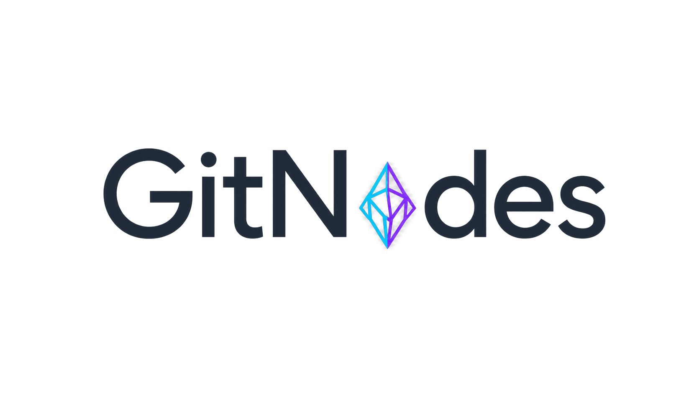
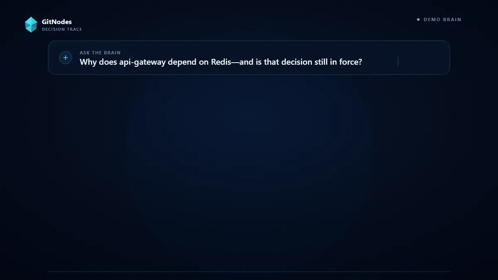

<p align="center">
  <picture>
    <source media="(prefers-color-scheme: dark)" srcset="public/brand/gitnodes-wordmark-dark.webp">
    
  </picture>
</p>

<p align="center">
  <strong>Your repository remembers what happened. GitNodes helps it remember why.</strong>
</p>

<p align="center">
  A Git-native knowledge graph for engineering teams and the agents working beside them.<br>
  Trace decisions through systems, incidents, postmortems, and the changes that superseded them.
</p>

<p align="center">
  <a href="https://gitnodes-demo-production.up.railway.app">Live demo</a> ·
  <a href="#try-it-in-60-seconds">Try locally</a> ·
  <a href="docs/README.md">Documentation</a> ·
  <a href="docs/guides/AGENT_WALKTHROUGH.md">Agent walkthrough</a>
</p>

<p align="center">
  <a href="https://github.com/AndreaBozzo/gitnodes/actions/workflows/ci.yml"></a>
  <a href="https://github.com/AndreaBozzo/gitnodes/releases/latest"></a>
  <a href="LICENSE"></a>
</p>

<p align="center">
  <picture>
    <source media="(prefers-reduced-motion: reduce)" srcset="public/screenshots/knowledge-memory-poster.webp">
    
  </picture>
</p>

The story above is not concept art. It is assembled from the linked markdown in
[`examples/demo-brain`](examples/demo-brain): a useful decision made Redis a
tier-1 dependency, 40% of users were logged out, the postmortem found the
missing system-level promise, and a later ADR reversed the decision.

```text
“Why does api-gateway depend on Redis—and is that decision still in force?”

ADR-0004 ──affects──▶ session-store ◀──affected── 11 March outage
    ▲                                             │ postmortem
    │                                             ▼
    └──supersedes── ADR-0009 ◀──resulted_in── #145 ◀──action_items── postmortem
```

An agent reaches that answer by traversing relationships, including the
incoming `supersedes` edge that marks the original ADR as obsolete. Plain text
search usually finds the old decision. GitNodes finds what happened to it.

## Why GitNodes

- **Answers with history attached.** Typed relationships distinguish an active
  decision from one that has been superseded, and connect incidents to the
  systems, runbooks, action items, and people around them.
- **One source of truth.** Notes remain ordinary markdown in Git. SQLite is a
  disposable search and graph projection—not another knowledge silo.
- **Built for humans and agents.** People browse and edit the graph in the web
  UI; agents search and traverse the same working tree through read-only MCP
  tools, then author through normal Git commits.
- **Review is part of the model.** UI writes follow GitHub permissions: direct
  commit when allowed, pull-request fallback when review is required.

## Try it in 60 seconds

Install a single binary—no Rust toolchain is needed:

```bash
# macOS / Linux
brew install andreabozzo/tap/gitnodes

# Windows
winget install AndreaBozzo.GitNodes
```

Then open the complete demo locally. Preview mode is read-only, uses an
in-memory index, and needs no login or GitHub token.

```bash
git clone https://github.com/AndreaBozzo/gitnodes
gitnodes preview gitnodes/examples/demo-brain
```

Or start a knowledge base of your own:

```bash
gitnodes init my-brain
cd my-brain
gitnodes preview
```

`init` creates the taxonomy, linked starter notes, and agent configuration for
Claude Code, Cursor, Codex, and Antigravity. When the brain is ready to share,
push it to GitHub and run `gitnodes serve`; GitNodes discovers the remote and
reuses your existing `gh auth` login.

## How it stays trustworthy

```text
markdown + YAML frontmatter                 browser UI
            │                                   │
            ├── rebuild ──▶ graph + search ◀────┤ read
            │               projection          │
            │                    ▲               │
            │                    │               │
            └──── ordinary commits / PRs ◀──────┘ write
                                 ▲
                                 │
                       read-only MCP tools
                                 │
                              agents
```

Git is the only content write target. The projection can be deleted and rebuilt
from a clean clone. The local MCP server deliberately cannot write: agents edit
the checkout under the repository's generated `AGENTS.md`, leaving ordinary,
reviewable diffs.

## Explore the details

| If you want to… | Go here |
|---|---|
| Move from first preview to a shared GitHub-backed brain | [Getting started](docs/guides/GETTING_STARTED.md) |
| Watch an agent reconstruct the Redis decision end to end | [Agent walkthrough](docs/guides/AGENT_WALKTHROUGH.md) |
| Define node types, typed links, views, and work items | [Configuration](docs/guides/CONFIGURATION.md) |
| Understand the crates, data flow, and trust boundaries | [Architecture](docs/ARCHITECTURE.md) |
| Deploy OAuth, persistence, webhooks, and health checks | [Deployment](docs/guides/DEPLOYMENT.md) |
| Check exact capabilities and honest limitations | [Feature inventory](docs/FEATURES.md) |
| Operate or recover a running instance | [Operator notes](docs/OPERATOR_NOTES.md) |
| See what is stable, next, or deliberately out of scope | [Roadmap](docs/ROADMAP.md) |

GitNodes is built with Rust, Leptos, Axum, and SQLite. The deployable app is
AGPL-3.0-or-later; the reusable domain, graph, auth, and storage crates are
Apache-2.0. See [CONTRIBUTING.md](CONTRIBUTING.md) for local development and
[the complete license notice](LICENSE).
