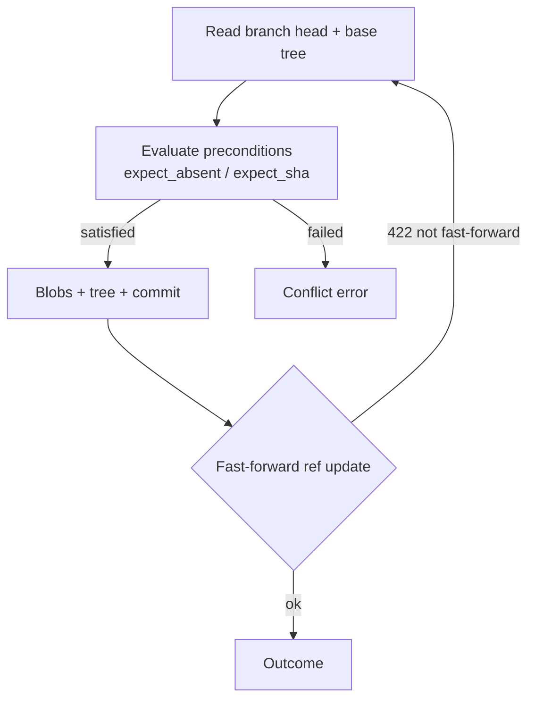

# gitnodes-storage

GitHub API client and the atomic write layer for GitNodes. The most mature
crate in the workspace: `git_transaction` commits multiple files in one
operation via the Git Data API, with typed preconditions and fast-forward retry.

- `GitTransaction` — single atomic commit against the served branch (above).
- `BranchTransaction` — owns an ephemeral branch lifecycle: create ref, chain
  one or more commits, delete on commit failure, explicit rollback on PR-open
  failure. Powers the PR fallback path.
- `transaction.plan()` — read-only dry run: same precondition evaluator, no
  writes. Backs the config preview before/after.

**No Dual-Write:** mutations go to GitHub here; the SQLite projection in
`gitnodes-app` only updates through rebuild/webhook, never alongside a write.

Depends on [`gitnodes-domain`](../gitnodes-domain) and [`gitnodes-graph`](../gitnodes-graph).
Apache-2.0. Part of the [GitNodes workspace](../../README.md).
